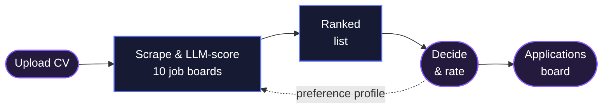

<div align="center">

# Job Finder

**Every job board in Poland, read overnight and ranked against one CV.**


[How it works](#how-it-works) · [Pipeline](#pipeline) · [Quick start](#quick-start) · [Model provider](#model-provider) · [Design notes](#design-notes)

<br>


</div>

<br>

## How it works

Ten job boards go in, one ranked list comes out. Every offer gets a match score against my
CV, and I decide on it in one click. Those decisions feed back into the prompt that scores
the next run. Violet comes from me, blue runs on its own.



## Pipeline

One command, seven stages, always in this order. A failed stage stops the run, and
`--resume` picks up where it stopped.

| # | Stage | Why it is there |
|:-:|---|---|
| 0 | `purge_stale_offers` | archives my ratings before old offers are dropped |
| 1 | `main_scraper` | pulls every board in parallel: the API where there is one, HTML where not |
| 1.5 | `migrate_normalize_links` | the same offer under `?utm_source=…` must not count twice |
| 2 | `deduplicate_db` | one offer often sits on four boards at once |
| 2.5 | `clean_db` | trims boilerplate so scoring does not burn tokens on it |
| 3 | `waterfall_analysis` | a cascade of models from the chosen provider; API keys rotate |
| 4 | `eval_ranking` | checks the ranking against ratings I entered by hand |

<div align="center">

<br>
<sub>The pipeline sheet in the UI: per-stage counts, scoring batches, key rotation, live log.</sub>
</div>

## Quick start

```bash
pip install -r requirements.txt
playwright install chromium
cp .env.example .env                      # pick a model provider, add its API key

cd frontend && npm install && npm run build && cd ..
PYTHONIOENCODING=utf-8 python server.py   # → http://127.0.0.1:8501
```

Runs start from the UI, which checks the CV and keys and asks for API cost consent first.

<details>
<summary><b>Command line</b></summary>

<br>

```bash
python run_final_pipeline.py                  # full run
python run_final_pipeline.py --skip-scraping  # score offers already in the DB (still paid)
python run_final_pipeline.py --resume         # continue an interrupted or failed run

python eval_ranking.py                        # is the ranking any good?
python skill_gaps.py                          # what the good offers ask for and the CV lacks
python benchmark_models.py                    # which model agrees with my ratings
python compare_before_after.py                # did a prompt change help?

PYTHONIOENCODING=utf-8 python tests/integration_test.py   # no API calls
```

Success is exit code 0 **and** `PIPELINE COMPLETE`. For frontend work, `npm run dev` in
`frontend/` serves on port 5173 and proxies `/api` to `server.py`.

</details>

## Model provider

Scoring is not tied to one vendor. Set `LLM_PROVIDER` in `.env` or switch it in the UI
before a run:

| `LLM_PROVIDER` | Key | Default cascade |
|---|---|---|
| `gemini` (default) | `GEMINI_API_KEY_PRIMARY` | `gemini-3.5-flash-lite` → `gemini-3.1-flash-lite` → `gemini-3.6-flash` → `gemini-2.5-flash` |
| `openai` | `OPENAI_API_KEY` | `gpt-6-luna` |
| `anthropic` | `ANTHROPIC_API_KEY` | `claude-haiku-4-5` → `claude-sonnet-5` |

`openai` speaks the Chat Completions API, so `OPENAI_BASE_URL` points it at any compatible
server: OpenRouter, Groq, DeepSeek, Mistral, or a local Ollama / LM Studio. Your own cascade
goes in `GEMINI_MODELS`, `OPENAI_MODELS` or `ANTHROPIC_MODELS`, comma-separated, first choice
first. Extra keys (`…_1` to `…_4`) rotate when one hits a rate limit.

```bash
# a local model through Ollama, no API bill
LLM_PROVIDER=openai
OPENAI_BASE_URL=http://localhost:11434/v1
OPENAI_API_KEY=ollama
OPENAI_MODELS=qwen3:14b
```

Every provider gets the same prompt and the same JSON schema. Only the Gemini cascade is
benchmarked against my ratings; run `python benchmark_models.py <model> …` before trusting
another one.

## Design notes

- **A cascade, not one model.** The first model scores the bulk; when it hits a limit or
  fails, the run moves to the next key, then down the list. `benchmark_models.py` decides
  the order.
- **The profile is built from contrasts.** Near-identical offers I rated differently teach the
  model more than a pile of good examples.
- **Scores are never silently redone.** Existing scores stay; `--rescore-changed` and
  `--rescore-all` are explicit, because every rescore costs money.
- **Stopping is safe.** A stop lands between stages or scoring batches of 75; saved batches
  are never scored twice.
- **The database is JSON files** with atomic writes and backup rotation. Postgres is the
  obvious next step.
- **Personal data stays local.** Keys live in `.env`; the CV, ratings and decisions are
  gitignored.
