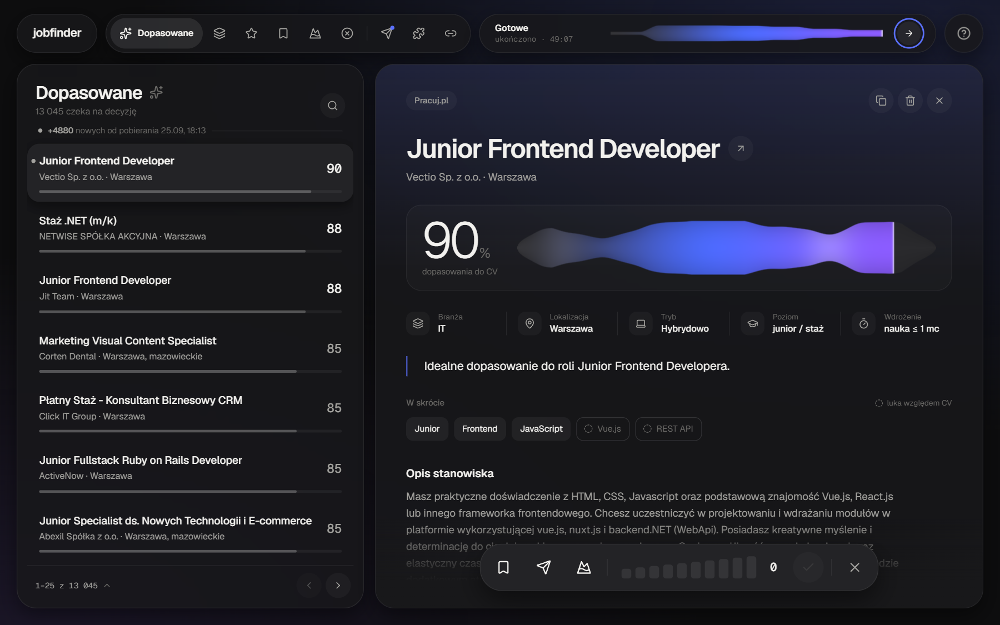

# Job Finder

Collects job postings from a dozen-odd Polish job boards, scores each one against my CV
with a language model and sorts them by how well they match. The database currently holds
15,701 offers.



## How it works

The pipeline runs in stages, each one a separate script:

```
main_scraper.py               collects offers from all sources in parallel
   └── scrapers/              one module per board — the API where there is one, HTML where there isn't
migrate_normalize_links.py    canonicalises URLs; runs before deduplication, because the same
                              offer under ?utm_source=… otherwise counts as two
deduplicate_db.py             removes duplicates — one offer often sits on four boards at once
clean_db.py                   trims descriptions so scoring doesn't burn tokens on boilerplate
waterfall_analysis.py         scoring: a cheap model takes the bulk, a stronger one picks up
                              what it declines; API keys rotate and an interrupted run resumes
eval_ranking.py               compares the ranking against ratings entered by hand
streamlit_app.py              the interface — browsing, filtering and rating offers
```

`python run_final_pipeline.py` runs the whole thing end to end.

Three more scripts sit outside the pipeline and are run by hand:

```
benchmark_models.py           measures how closely each model agrees with my own ratings
compare_before_after.py       the only way to tell whether a prompt change helped: the
                              pipeline skips offers I have rated, so the stored scores for
                              the test set never refresh
enrich_olx_descriptions.py    fetches the real text for OLX offers left with a placeholder
```

The interface is a single screen: offers on the right, details and decision buttons on the
left. Rating an offer moves it between tabs — saved, applied, aspirational, rejected.

## Running it

```bash
pip install -r requirements.txt
playwright install chromium

cp .env.example .env        # add your own Gemini key
python run_final_pipeline.py
streamlit run streamlit_app.py
```

API keys are read only from `.env`, which never enters the repository. Personal data —
my CV and my rating history — stays out too; see `.gitignore`.

## Stack

Python · Playwright · Gemini API · Streamlit · BeautifulSoup

---
---

# Job Finder

Zbiera ogłoszenia o pracę z kilkunastu polskich portali, ocenia modelem językowym, jak
każde z nich pasuje do mojego CV, i układa je od najlepiej dopasowanych. W bazie jest teraz
15 701 ofert.


## Jak to działa

Pipeline idzie etapami, każdy to osobny skrypt:

```
main_scraper.py               zbiera oferty ze wszystkich źródeł równolegle
   └── scrapers/              jeden moduł na portal — API tam, gdzie jest, HTML tam, gdzie nie ma
migrate_normalize_links.py    ujednolica adresy; idzie przed deduplikacją, bo bez tego ta sama
                              oferta pod ?utm_source=… liczyłaby się jako dwie różne
deduplicate_db.py             usuwa duplikaty — jedna oferta bywa naraz na czterech portalach
clean_db.py                   skraca opisy, żeby ocena nie przepalała tokenów na wypełniaczu
waterfall_analysis.py         ocena: tańszy model bierze większość, mocniejszy wchodzi tam,
                              gdzie tańszy odmówił; klucze API się rotują, przerwany bieg wznawia
eval_ranking.py               porównuje ranking z ocenami wystawionymi ręcznie
streamlit_app.py              interfejs — przeglądanie, filtrowanie i ocenianie ofert
```

`python run_final_pipeline.py` przechodzi całość od początku do końca.

Trzy skrypty stoją poza pipelinem i uruchamia się je ręcznie:

```
benchmark_models.py           mierzy, jak bardzo każdy model zgadza się z moimi ocenami
compare_before_after.py       jedyny sposób, żeby stwierdzić, czy zmiana promptu pomogła:
                              pipeline pomija oferty, które oceniłem, więc zapisane wyniki
                              dla zbioru testowego nigdy się nie odświeżają
enrich_olx_descriptions.py    dociąga prawdziwą treść ofert OLX, które zostały z zaślepką
```

Interfejs to jeden ekran: po prawej oferty, po lewej szczegóły i przyciski decyzji. Ocena
oferty przenosi ją między zakładkami — zapisane, wysłane, aspiracyjne, odrzucone.

## Uruchomienie

```bash
pip install -r requirements.txt
playwright install chromium

cp .env.example .env        # wpisz własny klucz Gemini
python run_final_pipeline.py
streamlit run streamlit_app.py
```

Klucze API czytane są wyłącznie z `.env`, który nigdy nie trafia do repozytorium. Dane
osobowe — moje CV i historia moich ocen — też są poza repo; patrz `.gitignore`.

## Stack

Python · Playwright · Gemini API · Streamlit · BeautifulSoup
