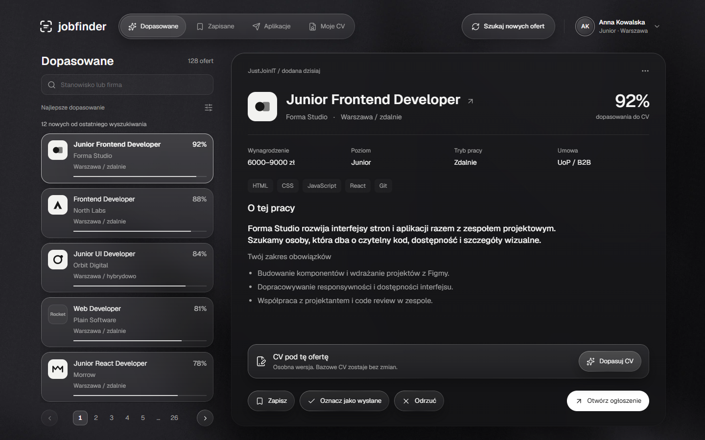
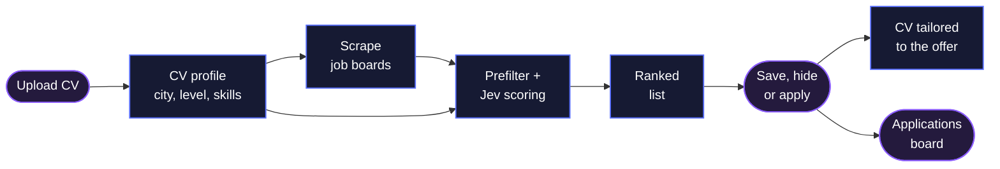
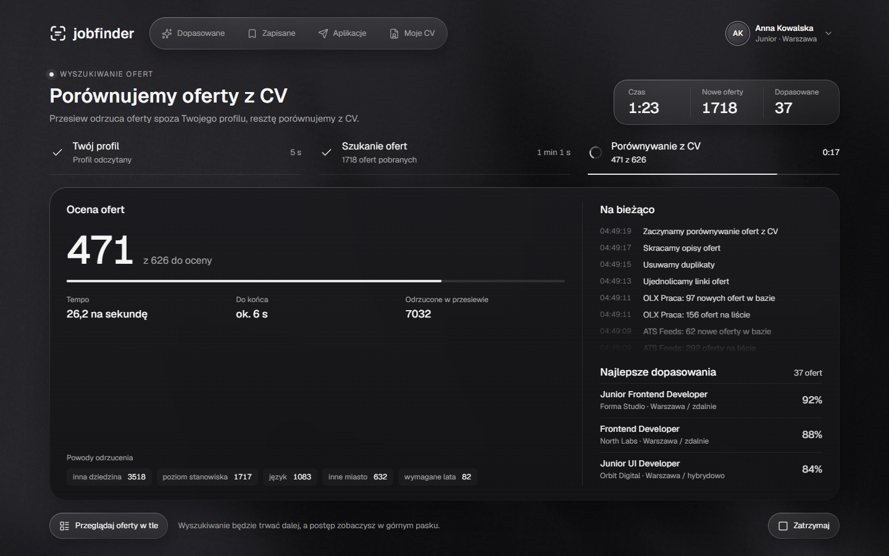

<div align="center">

# Job Finder

**Every job board in Poland, read overnight and ranked against one CV.**


[How it works](#how-it-works) · [Pipeline](#pipeline) · [Quick start](#quick-start) · [Matching](#matching) · [CV per offer](#cv-per-offer) · [CV reader](#cv-reader) · [Design notes](#design-notes)

<br>



</div>

<br>

## How it works

Job boards go in, one ranked list comes out. The CV is the only input: it sets the city and
seniority the scrapers look for, and every offer gets a match percentage against it. I save an
offer for later, hide it, or mark it as sent, and a sent offer moves along the applications
board. Violet comes from me, blue runs on its own.


```mermaid
flowchart LR
    cv(["Upload CV"]) --> profile["CV profile<br/>city, level, skills"]
    profile --> run["Scrape<br/>job boards"]
    run --> match["Prefilter +<br/>Jev scoring"]
    profile --> match
    match --> list["Ranked<br/>list"]
    list --> me(["Save, hide<br/>or apply"])
    me --> tailor["CV tailored<br/>to the offer"]
    me --> apps(["Applications<br/>board"])

    classDef step fill:#161a33,stroke:#5A70FF,stroke-width:1.5px,color:#ffffff
    classDef me fill:#241a3d,stroke:#8B5CFF,stroke-width:1.5px,color:#ffffff
    class profile,run,match,list,tailor step
    class cv,me,apps me
```

## Pipeline

One command, always in this order. A failed stage stops the run, and `--resume` picks up
where it stopped.

| # | Stage | Why it is there |
|:-:|---|---|
| 0 | `purge_stale_offers` | archives my ratings before old offers are dropped |
| 0.5 | `utils/cv_profile` | reads the CV once per change: city, level, skills, languages |
| 1 | `main_scraper` | pulls every board in parallel: the API where there is one, HTML where not |
| 1.5 | `migrate_normalize_links` | the same offer under `?utm_source=…` must not count twice |
| 2 | `deduplicate_db` | one offer often sits on four boards at once |
| 2.5 | `clean_db` | trims boilerplate from descriptions |
| 3 | `matching/run` | drops certain mismatches in code, scores the rest with Jev |
| 4 | `eval_ranking` | checks the ranking against the offers I saved, sent or hid |

<div align="center">

<br>
<sub>A search in the UI: stages, offers checked so far, best matches from this run.</sub>
</div>

## Quick start

```bash
pip install -r requirements.txt
playwright install chromium
cp .env.example .env                      # TYPESAFE_API_KEY + a key for the CV reader

cd frontend && npm install && npm run build && cd ..
PYTHONIOENCODING=utf-8 python server.py   # → http://127.0.0.1:8501
```

Runs start from the UI, which checks the CV and keys first.

<details>
<summary><b>Command line</b></summary>

<br>

```bash
python run_final_pipeline.py                  # full run
python run_final_pipeline.py --skip-scraping  # match offers already in the DB
python run_final_pipeline.py --resume         # continue an interrupted or failed run
python run_final_pipeline.py --rescore-all    # rescore everything, e.g. after changing weights

python -m utils.cv_profile                    # show the profile read from the CV
python -m matching.run --limit 100            # score up to 100 new offers
python eval_ranking.py                        # is the ranking any good?

PYTHONIOENCODING=utf-8 python tests/integration_test.py   # no API calls
```

Success is exit code 0 **and** `PIPELINE COMPLETE`. For frontend work, `npm run dev` in
`frontend/` serves on port 5173 and proxies `/api` to `server.py`.

</details>

## Matching

Every scraper stores what the board gives as fields, not text: seniority, work mode,
contract, schedule, salary, required and nice-to-have skills, languages. Years of experience
and language requirements are read from the description when a board has no field for them.

Code drops only certain mismatches: a level two steps above the CV, far more years than the
CV shows, a required language the CV lacks. The rest goes to
[Jev](https://docs.typesafe.ai/), a model that returns typed answers with probabilities
instead of text, in two passes. The first pass sends the CV once with up to 100 offers, each
reduced to title, category, company and skills, and asks whether someone with this CV would
apply. Offers under a 15% chance stop there. In a test on about 2,000 already scored offers
this kept every offer that later scored 40% or more and dropped three in four of those under
20%, for about 130 input tokens per offer. The second pass sends the CV with the full offer
and asks six narrow questions (share of requirements met, how close the work is to the CV,
level fit, hard blockers, interview chance, whether the offer follows the direction the CV
points to). `matching/jev.py` turns them into a percentage with fixed weights, so the same
offer and CV always get the same score.

Both passes are cached per offer and CV. A run scores only new or changed offers; a new CV
runs both passes again for every offer.

## CV per offer

For an offer I want to apply to, the app writes a separate version of my CV. One LLM call
turns the CV text into structured JSON once per CV change; a second call edits that JSON for
the offer under the rules in `cv_tailor/default_instructions.md` (rules taken from the Rezi
resume builder). Code keeps the CV's shape and puts back the name, contact data and dates if
the model touched them. Every number the model estimated has to be confirmed, corrected or
removed before the PDF can be downloaded. The base CV never changes. The rules can be edited
in the UI.

## CV reader

One LLM call turns the CV into the profile. Set `LLM_PROVIDER` in `.env` or switch it in
the UI:

| `LLM_PROVIDER` | Key | Default models, first choice first |
|---|---|---|
| `gemini` (default) | `GEMINI_API_KEY_PRIMARY` | `gemini-3.6-flash` → `gemini-3.5-flash` → `gemini-3.5-flash-lite` → `gemini-2.5-flash` |
| `openai` | `OPENAI_API_KEY` | `gpt-5.6-terra` → `gpt-6-luna` |
| `anthropic` | `ANTHROPIC_API_KEY` | `claude-sonnet-5` → `claude-haiku-4-5` |

`openai` speaks the Chat Completions API, so `OPENAI_BASE_URL` points it at any compatible
server: OpenRouter, Groq, DeepSeek, Mistral, or a local Ollama / LM Studio. Your own list
goes in `GEMINI_MODELS`, `OPENAI_MODELS` or `ANTHROPIC_MODELS`, comma-separated. Extra keys
(`…_1` to `…_4`) take over when one hits a rate limit.

## Design notes

- **The CV is the only input.** No hand-written preference profile; city and level for the
  scrapers come from the CV too.
- **Narrow questions, fixed formula.** A single "what percent" answer drifts between runs.
  Separate questions combined in code stay stable, and a weight change is a number in code.
- **Prefilter errs on the side of keeping.** An offer dropped in code never reaches the
  list, so only clear mismatches are dropped there.
- **Stopping is safe.** A stop lands between stages or between scored offers; saved scores
  are never redone.
- **The database is JSON files** with atomic writes and backup rotation. Postgres is the
  obvious next step.
- **Personal data stays local.** Keys live in `.env`; the CV, its profile, CV versions, scores,
  ratings and decisions are gitignored.
